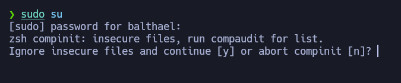
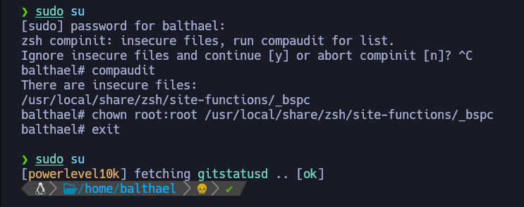

# Entorno de S4vitar en Kali Linux 100% Funcional


Bienvenidos a la guía de personalización del entorno de S4vitar en Kali Linux. Aquí encontrarás todos los pasos necesarios para una instalación completa y funcional.

## Video Tutorial

Puedes seguir el video tutorial paso a paso en mi [canal de YouTube](https://youtu.be/YUgXB2IZtcQ). Si el contenido es de tu agrado, considera suscribirte y seguirme en [LinkedIn](https://www.linkedin.com/in/johnosoriob/).
Recuerda que este script esta diseñado para un sistema operavito Kali Linux en Ingles, si lo quieres en español, cambia en el install.sh Downloads por Descargas. 

## Instalación

Clona el repositorio y prepara la instalación con los siguientes comandos:

```bash
git clone https://github.com/Balthael/KaliEntorno
cd KaliEntorno
chmod +x install.sh
sudo ./install.sh
```

Después de la instalación, asegúrate de seleccionar BSPWM e instalar `fzf` y `nvim`, ya que no están incluidos en el script inicial.

 

### Problemas comunes

Si encuentras un error al cambiar al usuario root, sigue estos pasos para corregirlo:



Solución:

```bash
Ctrl + C
compaudit
chown root:root /usr/local/share/zsh/site-functions/_bspc
exit
```



### Instalación de fzf

Instalación para usuarios root y no privilegiados:

**Root:**

```bash
sudo su
git clone --depth 1 https://github.com/junegunn/fzf.git ~/.fzf
~/.fzf/install
```

**Usuario no privilegiado:**

```bash
git clone --depth 1 https://github.com/junegunn/fzf.git ~/.fzf
~/.fzf/install
```

### Instalación de Neovim

#### Para Root:

```bash
sudo su
cd
git clone https://github.com/NvChad/starter ~/.config/nvim
mkdir /opt/nvim
cd /opt/nvim
mv /home/su_usuario/KaliEntorno/neovim/nvim-linux64 .
cd /opt/nvim/nvim-linux64/bin
./nvim
```

#### Para Usuario No Privilegiado:

```bash
cd
git clone https://github.com/NvChad/starter ~/.config/nvim
nvim
```

Atajos (Personalización de entorno en Linux)

| Combinación           | Acción                                   |
| --------------------- | ---------------------------------------- |
| `Windows + Enter`     | Abrir Terminal                           |
| `Windows + Q`         | Cerrar Terminal                          |
| `Windows + D`         | Abrir Rofi                               |
| `Windows + Esc`       | 'Aplicar' la configuración               |
| `Windows + Shift + R` | Recargar Entorno                         |
| `Windows + Shift + Q` | Volver a la pantalla de bloqueo          |
| `Esc + Esc`           | Sudo                                     |
| `Ctrl + Alt + Mouse`  | Seleccionar copiar/pegar en modo Columna |
| `Windows + Shift + X` | Bloquear Entorno                         |

#### 🔹 Polybar

|Combinación|Acción|
|---|---|
|`Windows + 1 - 0`|Desplazamiento por ventanas|
|`Windows + Shift + 1 - 0`|Enviar el proceso actual a otra ventana de trabajo|

#### 🔹 Preselectores

|Combinación|Acción|
|---|---|
|`Windows + Ctrl + Alt + Flechas`|Abrir Preselector|
|`Windows + Ctrl + Alt + Espacio`|Cerrar Preselector|
|`Windows + Ctrl + 1 - 0`|Cambiar tamaño del Preselector|
|`Windows + Ctrl + M`|Seleccionar proceso y enviarlo a un Preselector nuevo|
|`Windows + Y`|Aplicar proceso previamente seleccionado|

#### 🔹 Terminal

|Combinación|Acción|
|---|---|
|`Windows + S`|Ejecutar Terminal de forma Ventana Flotante (Screen Floating)|
|`Windows + F`|Ejecutar Terminal de forma Pantalla Completa (Full Screen)|
|`Windows + T`|Ejecutar Terminal de forma Encajada (Terminal)|
|`Windows + Click Izquierdo`|Mover la ventana flotante (Mouse)|
|`Windows + Click Derecho`|Ampliar o reducir el tamaño de la ventana (Mouse)|
|`Windows + Ctrl`|Mover ventana flotante (Atajo)|
|`Windows + Alt`|Ampliar o reducir el tamaño de la ventana (Atajo)|
|`Windows + Shift + Flechas`|Intercambiar terminal de Izquierda/Derecha/Arriba/Abajo|

#### 🔹 Kitty

|Combinación|Acción|
|---|---|
|`Ctrl + Shift + Enter`|Abrir terminal o múltiples|
|`Ctrl + Shift + W`|Cerrar terminal|
|`Ctrl + Shift + R`|Ampliar o reducir tamaño de la terminal (T=Arriba S=Abajo)|
|`Ctrl + Shift + T + número`|Nueva pestaña/etiqueta|
|`Ctrl + Shift + Alt + T`|Renombrar|
|`Ctrl + Shift + Alt + , / .`|Desplazamiento por pestañas (Signo coma o punto)|

#### 🔹 FZF

|Combinación|Acción|
|---|---|
|`Ctrl + R`|Buscar por el Historial (utiliza Flechas para desplazarte)|
|`wh Ctrl + T`|Te mueves por lo que hayas escrito anteriormente (`escribes wh`)|
|`cd ** Ctrl + T`|Buscar directorios (`escribes cd**`)|
|`rm Ctrl + T`|Seleccionas con TAB archivos a eliminar y con ENTER aceptas (`escribes rm`)|

---

## Contacto

Si tienes preguntas o necesitas ayuda, no dudes en escribirme a mi [LinkedIn](https://www.linkedin.com/in/johnosoriob/).

Gracias

